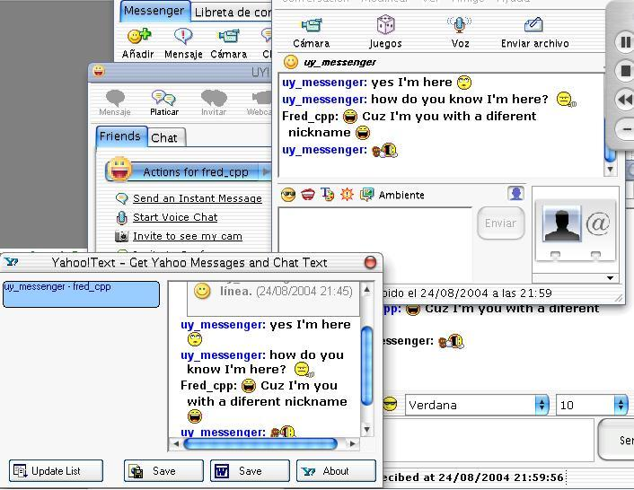



## Get Yahoo\! IMWindows Chat Text\! \(With colors/fonts/sizes and smileys\!

### Description

Do you want to save your conversations from Yahoo! Messeenger with colors/fonts/smileys? here's the solution!. you can write whatever you want and before close the IMWindow, open GetY!Text, double click the window you want to save the conversation from in the GetY!Text list and the app will get the text for you, ready to be saved In HTML Format or In a Word Document!

Updated to work with The new Yahoo Messenger 6.0
 
### More Info
 

             |
---                |---
**Submitted On**   |2004-08-24 17:42:40
**By**             |[Fred\.cpp](https://github.com/Planet-Source-Code/PSCIndex/blob/master/ByAuthor/fred-cpp.md)
**Level**          |Intermediate
**User Rating**    |5.0 (10 globes from 2 users)
**Compatibility**  |VB 5\.0, VB 6\.0
**Category**       |[Complete Applications](https://github.com/Planet-Source-Code/PSCIndex/blob/master/ByCategory/complete-applications__1-27.md)
**World**          |[Visual Basic](https://github.com/Planet-Source-Code/PSCIndex/blob/master/ByWorld/visual-basic.md)
**Archive File**   |[Get\_Yahoo\!1785558242004\.zip](https://github.com/Planet-Source-Code/fred-cpp-get-yahoo-imwindows-chat-text-with-colors-fonts-sizes-and-smileys__1-55802/archive/master.zip)

